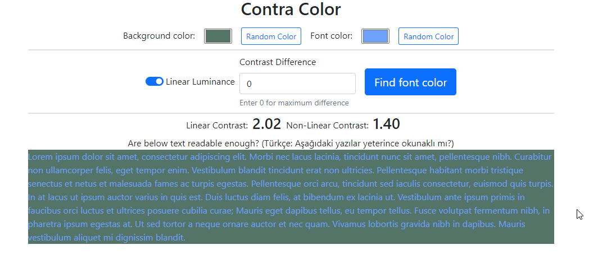

# contra-color

For a given color, find a contrasting color (not optimal).

 <p align="center">
    
 </p>

## Usage

### Use [npm](https://www.npmjs.com/)

Run command `npm i contra-color`

### Manuel build

Get the source codes from Github. You can clone it with the command `git clone https://github.com/canbax/contra-color.git` or download ZIP. To build run `npm i` and then `npm run build` inside the root folder of the project.

## API

### `function getContrastingColor(c: string, isLinearLuminance?: boolean, contrastDiff?: number): IContraColor`

- get a contrasting color for a given color
- If `isLinearLuminance` is true, it will use the linear luminance formula. Otherwise, it will use power curve formula.
- Set `contrastDiff` as 0 to find color with maximum contrast. If you pass a number in range (0,20], it will find a color with a the smallest contrast that is greater then `contrastDiff`

### `function getContrast(c1: string, c2: string, isLinearLuminance?: boolean): number`

- Find contrast of two colors.
- If you pass isLinearLuminance, it will calculate luminance with power curve formula.

## Problem

What is the best font color for a certain background color? AFAIK, this question doesn't have a scientifically proven answer for now (29 October 2021).

## Background

[World Wide Web Consortium (W3C)](https://en.wikipedia.org/wiki/World_Wide_Web_Consortium) publishes some guidelines like [Web Content Accessibility Guidelines (WCAG)](https://developer.mozilla.org/en-US/docs/Glossary/WCAG). According to these, [contrast ratio](https://www.w3.org/TR/WCAG20/#contrast-ratiodef) is defined as $$(L_1 + 0.05) / (L_2 + 0.05)$$ where $L_1$ is the relative luminance of the lighter of the colors, and $L_2$ is the relative luminance of the darker of the colors. [ Mozilla Developer Network (MDN)](https://developer.mozilla.org/en-US/) provides explanations about [calculating relative luminance](https://developer.mozilla.org/en-US/docs/Web/Accessibility/Understanding_Colors_and_Luminance#calculating_relative_luminance).

In the below codes, `luminance` function defines the relative luminance. If you give RBG values which are in range [0,255], the function will return a `luminance` value.

```
function luminance(R: number, G: number, B: number) {
  const r = sRGBtoLin(R);
  const g = sRGBtoLin(G);
  const b = sRGBtoLin(B);
  return r * 0.2126 + g * 0.7152 + b * 0.0722;
}

function sRGBtoLin(colorChannel: number) {
  colorChannel = colorChannel / 255;
  if (colorChannel <= 0.04045) {
    return colorChannel / 12.92;
  } else {
    return Math.pow((colorChannel + 0.055) / 1.055, 2.4);
  }
}
```

According to the above definitions of _contrast ratio_ and _relative luminance_, the _contrast ratio_ can be 1 at minimum, 21 at maximum.

### Human Perception of Luminance

According to [MDN](https://developer.mozilla.org/en-US/docs/Web/Accessibility/Understanding_Colors_and_Luminance#perceptual_lightness), human perception is roughly a power curve. For this reason, we also let the user use non-linear luminance values.

### Too High Contrast Ratio

According to [some reseearch](https://www.anec.eu/images/Publications/technical-studies/ANEC-final-report-1503-1700-Lenoir-et-al.pdf) too high contrast difference is not that good.

> Among the contrast revisions, provide guidance on excessive contrast — too high of a contrast causes reading problems and eye strain as well.

source: https://github.com/w3c/wcag/issues/695#issuecomment-483077339

## Solution

### Brute Force

Brute force search for finding the best contrasting color needs three `for` loops for each color channel. This means 256*256*256 = 16777216 lines of execution. This takes time!.

### Greedy Search

We make a greedy search. We iterate over each channel just once. We start from the most important channel to the least important channel. The most important channel is **green** since its coefficient is the largest _0.7152_ in the equation, the least important channel is **blue** since its coefficient is the smallest _0.0722_ in the equation. Since greedy search does not give an optimal solution, we also start from different colors like black, white and, a random color.

### Limiting Contrast Difference

To limit the contrast ratio, we start from the current color and then we diverge. As mentioned before too high contrast might not be ideal for readability.

## Comments and Discussion

- The algorithm might not give always the color with maximum contrast.
- If you specify a `contrastDiff` again it might not give a color with a high contrast.
- There are some discussions regarding [Contrast Ratio Math](https://github.com/w3c/wcag/issues/695). So even the formulas accepted by W3C are questionable and can be changed in the future.
- For me, it is very interesting that this is an active research question.
